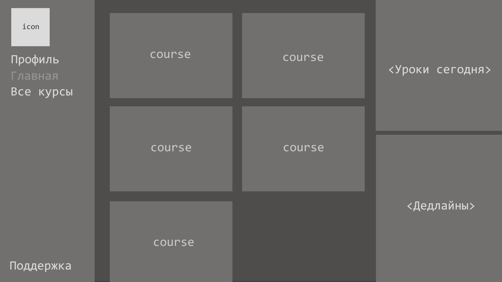

# Extremum

Платформа онлайн-школы, на которой проходят курсы по подготовке к ЕГЭ.

# Разделы:
- [Главная](#главная)
- [Профиль](#профиль)
- [Все курсы](#все-курсы)
- [Поддержка](#поддержка)

# Главная

Содержимое:
- Курсы, на которые записан ученик
- Уроки, которые буду сегодня
- Дедлайны по д/з на ближайшие 3 дня

- icon
  Аватарка ученика
- course

  Краткая информация по курсу.

  При клике переадресация на страницу курса.

  Содержимое:
  - Изображение курса
  - Прогресс-бар, который показывает количество пройденных уроков по сравнению со всеми
  - Заголовок курса
- <Уроки сегодня>

  Список уроков, которые были или будут сегодня.

  При клике переадресация на страницу урока.

  Содержимое:
  - Название урока и его номер
  - Время проведения
- <Дедлайны>

  Список домашних заданий, до сдачи которых осталось меньше 3-х дней.

  При клике переадресация на страницу урока, к которому относится д/з.

  Содержимое:
  - Название урока
  - Крайная дата и время сдачи

# Профиль

...
# Все курсы

...
# Поддержка

Переадресация в вк/тг чат.
